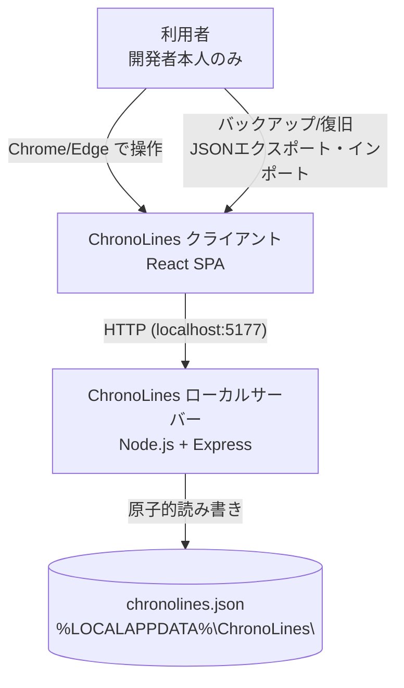
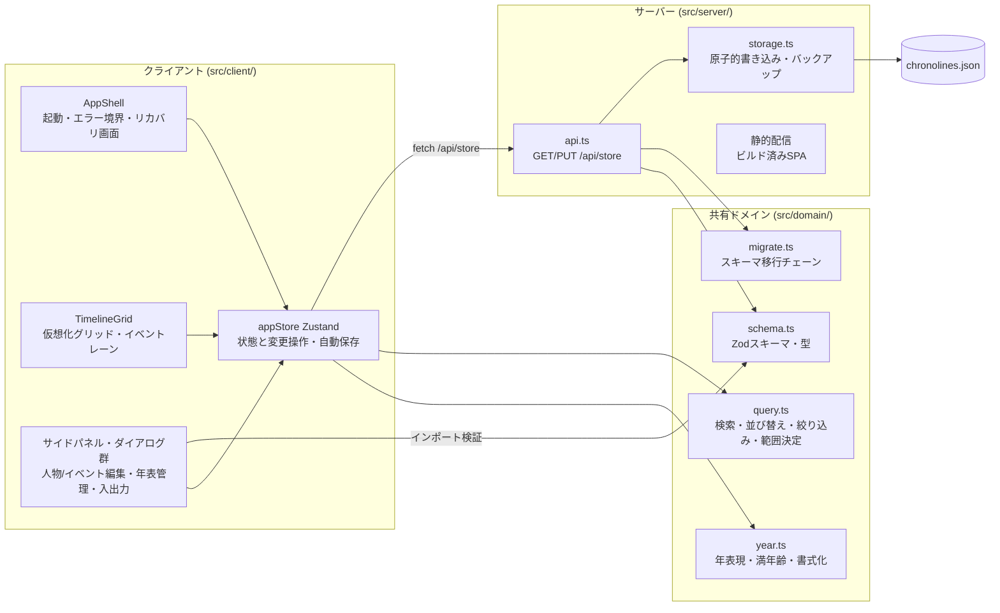
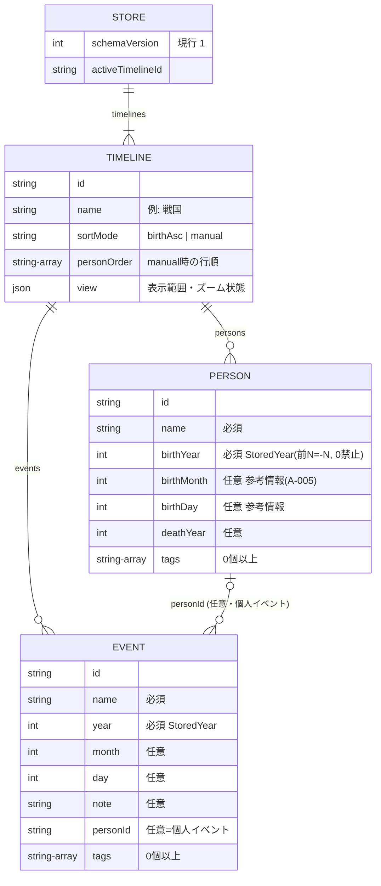

# アーキテクチャ設計書

ChronoLines — 複数人物の生存期間と年齢を横並びで比較する年表アプリ。
単一ユーザー・Windows PC・ローカル実行（ホスティングなし）。

## 1. 技術スタック

| 領域 | 選定技術 | 選定理由（詳細は ADR 参照） |
|---|---|---|
| フロントエンド | React 19 + TypeScript + Vite / Zustand / @tanstack/react-virtual / CSS Modules | ユーザー選定（React）。仮想描画で1000人×3000年グリッドの性能要件を満たす（[ADR 0001](adr/0001-tech-stack.md) / [ADR 0003](adr/0003-grid-rendering.md)） |
| バックエンド | Node.js 22+ / Express 4（ローカル薄サーバー） | 静的配信 + JSONファイル読み書きAPIのみの最小構成（[ADR 0001](adr/0001-tech-stack.md)） |
| データストア | ローカル単一JSONファイル（`%LOCALAPPDATA%\ChronoLines\chronolines.json`） | 原子的書き込み・スキーマ移行・配布物との分離（[ADR 0002](adr/0002-data-persistence.md)） |
| 共有ドメインロジック | TypeScript（`src/domain/` をクライアント・サーバーで共用） | 年齢計算・スキーマ検証・移行を単一実装に（[ADR 0004](adr/0004-bc-year-representation.md)） |
| インフラ/ホスティング | なし（ローカル実行のみ） | environment.md のとおり |
| CI/CD | なし（テスト・ビルドはローカル実行） | environment.md のとおり |

対応する ADR: [adr/](adr/)
前提となる環境情報: [environment.md](../01-requirements/environment.md)

## 2. システムコンテキスト図

外部サービス・外部APIへの接続は存在しない（ネットワーク送信機能を持たないこと自体が
NFRのセキュリティ要件）。サーバーは `127.0.0.1` のみを listen する。

## 3. コンポーネント構成図

依存方向の規約: `domain` はどこにも依存しない純粋ロジック（DOM・Node API 禁止）。
`client` と `server` は `domain` にのみ相互依存なしで依存する。

## 4. データモデル概要

保存データは単一JSONドキュメント（詳細スキーマ・Zod定義は
[detailed-design/data-model.md](detailed-design/data-model.md)）。

- 年の表現: 保存・入出力は `StoredYear`（前N = -N、0は不正）、内部計算は天文学的年数
  （[ADR 0004](adr/0004-bc-year-representation.md)）。
- セル（年齢）はデータとして持たない。描画時に O(1) で計算する（[ADR 0003](adr/0003-grid-rendering.md)）。

## 5. API / インターフェース概要

ローカルサーバーのHTTP API（詳細・エラー仕様は
[detailed-design/server-api.md](detailed-design/server-api.md)）。認証は行わない
（127.0.0.1 のみ・単一ユーザー・NFRで「該当なし」確定）。

| エンドポイント/インターフェース | 概要 | 認証要否 |
|---|---|---|
| GET /api/store | 保存データ全量 + リビジョン番号を返す。旧版は自動移行して返す。未知の新版/破損はエラーコード付きで拒否（US-010） | 不要 |
| PUT /api/store | 保存データ全量の置き換え。Zod検証 → 楽観ロック（rev照合）→ 原子的書き込み（US-009） | 不要 |
| GET /api/health | 稼働確認・アプリ版・データファイルパスを返す | 不要 |
| GET /（静的配信） | ビルド済みSPA | 不要 |
| （クライアント内）エクスポート | メモリ上のストアをJSONファイルとしてブラウザダウンロード。サーバー死亡時も動く退避手段 | - |
| （クライアント内）インポート | ファイル選択 → Zod検証 → 置換/追加の確認 → PUT（US-011） | - |

## 6. 非機能要件の実現方法

| NFR項目 | 実現方法 |
|---|---|
| 性能（初期表示3秒） | 起動時ロードは JSON 1ファイルの読み込み+パース（保証スケールで約2MB）のみ。セルの事前実体化をしない設計（ADR 0003）。リリース前に1000人・5000件・3000年の実データで実測 |
| 性能（操作応答100ms） | 行・列2軸のDOM仮想化 + メモ化 + Zustandセレクタ購読（ADR 0003）。検索・絞り込みは1000件の配列演算（1ms未満）。イベントは年別Mapに前集計 |
| 可用性（復旧 RPO=最終エクスポート） | JSONエクスポート/インポート（US-011）。加えて .bak 1世代と破損ファイルの改名保全で「黙って消える」を防ぐ（ADR 0002） |
| セキュリティ（XSS） | React の標準エスケープに委ねる。`dangerouslySetInnerHTML` は使用禁止（stack-conventions）。ユーザー入力（人物名・イベント名・メモ）を innerHTML に入れる経路を作らない |
| セキュリティ（インポート検証） | Zod による厳密なスキーマ検証（未知フィールド拒否・型・0年禁止・没年>=生年）。検証失敗時は既存データ無変更（US-011） |
| セキュリティ（外部送信なし） | サーバーは 127.0.0.1 のみ listen。外部への fetch を行うコードを持たない |
| 監視・ログ | 監視なし（NFR）。エラーは画面上のバナー/ダイアログでユーザーに通知。サーバーはコンソールへ最小限のログ |
| データ保全（更新をまたぐ） | データファイルは配布物と分離した %LOCALAPPDATA% に置き、schemaVersion による起動時自動移行（US-010、ADR 0002） |
| 対応環境 | Windows + 最新 Chrome/Edge を対象にテスト。スマホ最適化はしない |
| コスト0円 | 外部サービス・ホスティング・CI/CDを使わない |
| アクセシビリティ（色区別） | 生存中/仮想年齢の区別を色+書式（括弧表記）の二重チャネルで行い、コントラスト比を実測して確定（design-tokens.md に実測値） |

## 7. 要件対応表（トレーサビリティ）

| 要件ID | 対応する設計要素 |
|---|---|
| US-001 人物の登録・編集・削除 | [ui-forms-dialogs.md](detailed-design/ui-forms-dialogs.md)（人物フォーム・削除確認）、[data-model.md](detailed-design/data-model.md)（検証規則: 没年>=生年）、[domain-logic.md](detailed-design/domain-logic.md)（再計算はセル都度計算のため自動） |
| US-002 年表グリッドの年齢表示 | [ui-timeline-grid.md](detailed-design/ui-timeline-grid.md)（セル表示規則）、[domain-logic.md](detailed-design/domain-logic.md)（満年齢・仮想年齢の計算）、ADR 0003/0004 |
| US-003 イベントの登録・表示 | [ui-forms-dialogs.md](detailed-design/ui-forms-dialogs.md)（イベントフォーム）、[ui-timeline-grid.md](detailed-design/ui-timeline-grid.md)（イベントレーン・件数バッジ・年別一覧） |
| US-004 イベント時点の年齢比較 | [ui-timeline-grid.md](detailed-design/ui-timeline-grid.md)（イベント選択 → 列強調 + 年齢比較パネル） |
| US-005 紀元前の年への対応 | ADR 0004、[domain-logic.md](detailed-design/domain-logic.md)（year.ts 仕様・0年拒否）、[ui-forms-dialogs.md](detailed-design/ui-forms-dialogs.md)（入力形式 A-006） |
| US-006 表示年範囲の自動決定と手動指定 | [domain-logic.md](detailed-design/domain-logic.md)（範囲決定ロジック）、[ui-timeline-grid.md](detailed-design/ui-timeline-grid.md)（範囲指定UI・空範囲表示） |
| US-007 ズーム（1年⇔10年） | ADR 0003、[ui-timeline-grid.md](detailed-design/ui-timeline-grid.md)（10年列の集約表現・中心年保持） |
| US-008 検索・並び替え・タグ絞り込み | [domain-logic.md](detailed-design/domain-logic.md)（query.ts）、[ui-timeline-grid.md](detailed-design/ui-timeline-grid.md)（検索UI・行ドラッグ）、[data-model.md](detailed-design/data-model.md)（sortMode/personOrder の永続化） |
| US-009 ローカル保存と複数年表 | ADR 0002、[server-api.md](detailed-design/server-api.md)（自動保存・楽観ロック）、[ui-forms-dialogs.md](detailed-design/ui-forms-dialogs.md)（年表管理・削除確認） |
| US-010 バージョン更新をまたぐデータ引き継ぎ | ADR 0002、[data-model.md](detailed-design/data-model.md)（schemaVersion・移行チェーン）、[server-api.md](detailed-design/server-api.md)（NEWER_SCHEMA/CORRUPT エラーとリカバリ画面） |
| US-011 JSONエクスポート/インポート | [ui-forms-dialogs.md](detailed-design/ui-forms-dialogs.md)（入出力ダイアログ）、[data-model.md](detailed-design/data-model.md)（エクスポート形式 = 保存形式と同一） |
| US-012 画像出力（Could） | [ui-timeline-grid.md](detailed-design/ui-timeline-grid.md)（可視範囲のPNG出力） |
| NFR 性能/保全/セキュリティ | 本書 6章 + 各ADR |

## 7.5. spec-critic レビュー結果（ゲート承認前の独立レビュー）

- 実施日: 2026-08-12（spec-critic サブエージェント。独立コンテキスト・読み取り専用）
- 結果: BLOCKER 0件 / MAJOR 2件 / MINOR 8件。総評「MAJOR 2件の修正を条件に承認推奨。要件への差し戻しは不要」
- 検証済み事項: 全US・全受け入れ条件のトレーサビリティ両方向で欠落なし / エラーIDの
  ファイル間整合あり / 満年齢計算は glossary.md と数式レベルで一致（検算表9行を再計算）
- 対応:
  - MAJOR-1（10年境界の数式とモックアップの矛盾）: `decadeStart` を stored年ラベル整列の
    3ケース定義（西暦10以降/西暦1〜9の9年バケット/紀元前）に再定義し、境界検算表を追加。
    domain-logic.md・ui-timeline-grid.md・screen-02 を一致させた（反映済み）
  - MAJOR-2（A-004 の確認記録）: モックアップのユーザー確認をもって台帳に確定を記録する
    （設計ゲート承認と同時に実施）
  - MINOR 8件すべて反映済み: ADR 0001 の参照先修正 / timeline id 一意性規則
    （E-STORE-DUP-TIMELINE）/ 単一年表エクスポート時の activeTimelineId 差し替え /
    appendTimelines の personId 再マップ / autoRange の反転クランプと未来没年の挙動注記 /
    100ms実測はデバウンス除外の明記 / pagehide での保存フラッシュ / 検算表の kind 記載

## 8. 詳細設計

コンポーネント/画面/API単位の詳細設計は [detailed-design/](detailed-design/) を参照。

| ファイル | 内容 |
|---|---|
| [data-model.md](detailed-design/data-model.md) | 保存スキーマ（Zod/TypeScript定義）・検証規則・スキーマ移行・エクスポート形式 |
| [server-api.md](detailed-design/server-api.md) | APIの完全仕様（リクエスト/レスポンス例・エラーID）・原子的書き込み・自動保存プロトコル |
| [domain-logic.md](detailed-design/domain-logic.md) | year.ts / query.ts の関数シグネチャ・計算仕様・境界値 |
| [ui-timeline-grid.md](detailed-design/ui-timeline-grid.md) | メイン画面（グリッド・イベントレーン・ズーム・検索・範囲指定・画像出力）の詳細設計 |
| [ui-forms-dialogs.md](detailed-design/ui-forms-dialogs.md) | フォーム・ダイアログ群（人物/イベント/年表/入出力/エラー・リカバリ）の詳細設計 |

画面設計の正（合意済みモックアップ）: [ui/](ui/) — design-tokens.md と各 screen-*.html。
